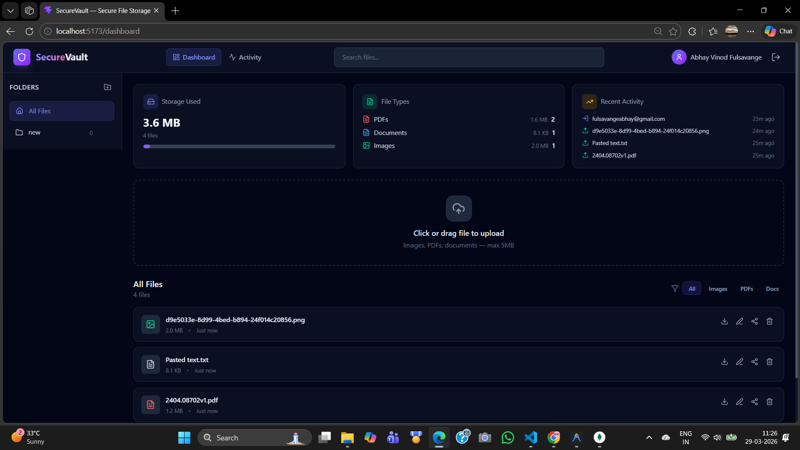
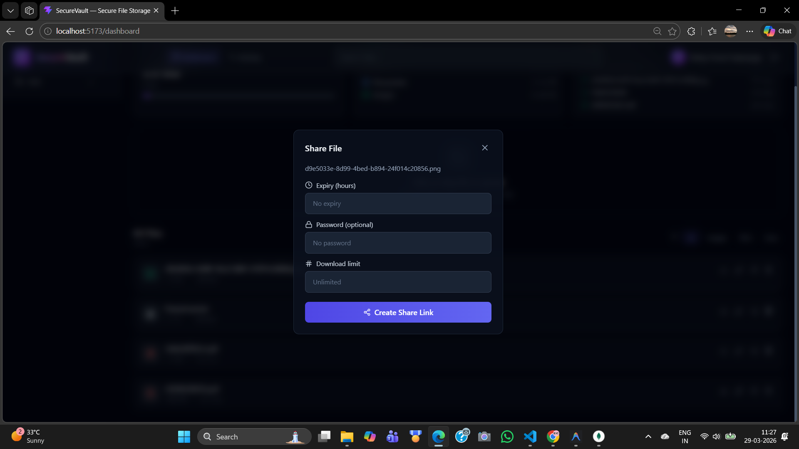
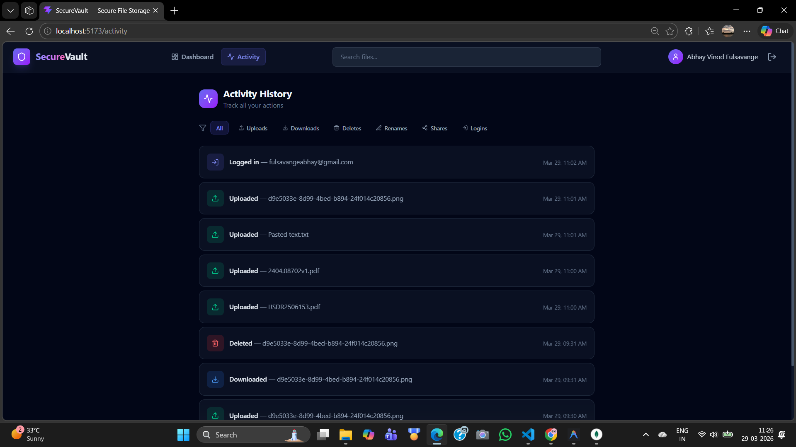

# 🚀 SecureVault — File Storage & Sharing Platform

🔐 A full-stack secure file storage system inspired by Google Drive, built using the MERN stack.
It allows users to upload, manage, and share files securely with authentication, activity tracking, and scalable backend architecture.

---

## 📸 Preview

### 🏠 Dashboard

Overview of files, folders, and user activity.


---

### 🔗 File Sharing

Share files using secure links with optional protection.


---

### 📊 Activity Tracking

Track user actions like uploads, deletes, and shares.


---

## 🎯 Why This Project Matters

This project demonstrates:

* Secure authentication system (JWT-based)
* Scalable backend design (modular architecture)
* File handling & storage logic
* Real-world features like sharing, tracking, and validation
* Clean frontend integration with API
* Refresh token rotation and secure cookie handling

💡 Built with focus on **backend engineering, security, and scalability**

---

## 📌 Features

### 🔐 Authentication & Security

* JWT-based authentication
* Protected API routes
* Environment variable protection
* Input validation (Zod)

### 📁 File Management

* Upload files with validation
* Folder-based organization
* Download & delete files
* File metadata handling

### 🔗 File Sharing

* Share files via unique links
* Password-protected access
* Expiry-based links
* Download tracking

### 📊 Activity Tracking

* Logs user actions (upload, delete, share, login)
* Backend logging system

### ⚡ Performance & Scalability

* Pagination support
* Optimized database queries
* Modular backend architecture

---

## 🏗 Tech Stack

### Frontend

* React 19 + Vite
* Tailwind CSS
* Axios
* React Router DOM

### Backend

* Node.js
* Express.js
* MongoDB / Mongoose
* JWT access + refresh token auth
* bcryptjs
* Multer
* Zod
* Cloudinary (optional)
* Helmet
* express-rate-limit
* cookie-parser

### Additional Libraries

* uuid
* cors
* dotenv

---

## 📂 Project Structure

```id="struct01"
SecureVault/
│
├── client/                # Frontend (React + Vite)
│   ├── src/
│   ├── public/
│   └── dist/ (ignored)
│
├── server/                # Backend (Node + Express)
│   ├── controllers/
│   ├── routes/
│   ├── middleware/
│   ├── services/
│   ├── utils/
│   ├── uploads/ (ignored)
│   └── __tests__/
│
└── README.md
```

---

## ⚙️ Installation & Setup

### 1️⃣ Clone the repository

```bash id="clone01"
git clone https://github.com/your-abhayvf07/securevault.git
cd securevault
```

---

### 2️⃣ Setup Backend

```bash id="backend01"
cd server
npm install
```

Create `.env` file:

```id="env01"
PORT=5000
MONGO_URI=your_mongodb_connection
JWT_SECRET=your_secret
CLIENT_URL=http://localhost:5173
```

Run backend:

```bash id="backend02"
npm run dev
```

---

### 3️⃣ Setup Frontend

```bash id="frontend01"
cd client
npm install
npm run dev
```

---

## 🚀 Deployment

* Frontend: Vercel / Netlify
* Backend: Render / Railway

---

## 🔒 Security Highlights

* JWT access + refresh token authentication
* httpOnly refresh cookie for secure token refresh
* File type validation with Multer
* Environment variable protection
* API-level validation using Zod
* Express rate limiting via express-rate-limit
* Helmet security headers

---

## 📊 Future Improvements

* Deploy frontend and backend to production
* Add AWS S3 support alongside Cloudinary
* Expand test coverage across backend APIs
* Implement file move between folders
* Add user collaboration and real-time sharing updates

---

## 🧪 Testing

* Basic API test structure included
* Easily extendable for full test coverage

## 🤝 Contributing

Contributions are welcome! Feel free to fork and submit a pull request.

---

## 📧 Contact

GitHub: https://github.com/abhayvf07

---

## ⭐ Support

If you like this project, give it a ⭐ on GitHub!
